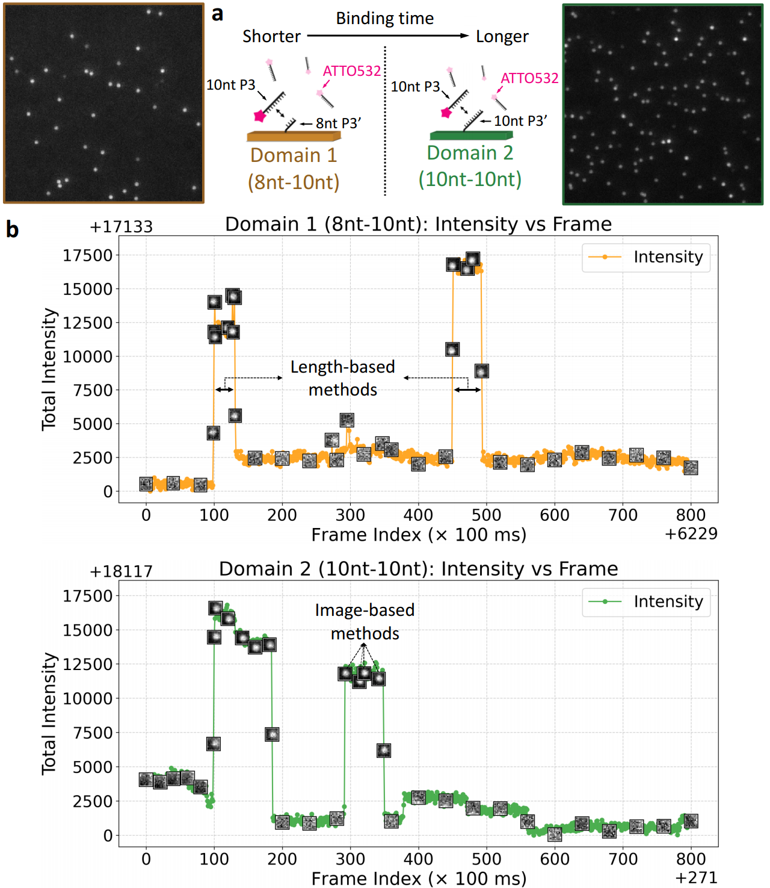
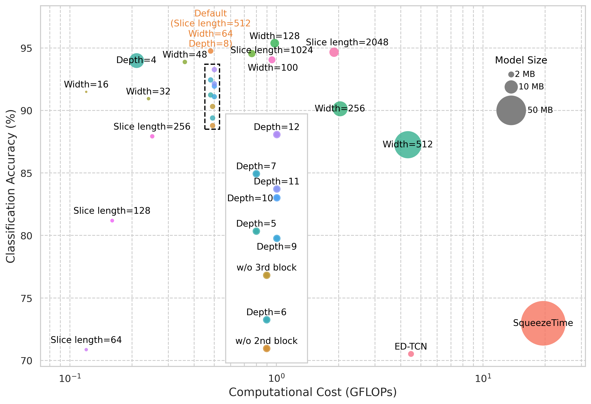
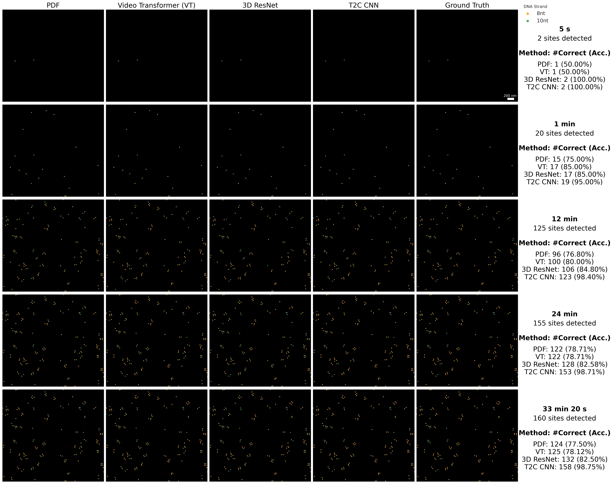

# T2C-CNN
Codes and data for the paper named "Discriminating Single-Molecule Binding Event from Diffraction-Limited Fluorescence". Under Review.

- This work is accorded Singapore provisional patent application number 10202403434P. All rights reserved by Yin Yueming (yueming.yin@ntu.edu.sg), Lipo Wang (elpwang@ntu.edu.sg), Thorsten Wohland (twohland@nus.edu.sg), Nithin Pathoor (nithin@nus.edu.sg) and Shao Ren Sim (shaoren.sim@u.nus.edu).

# Introduction

<figure>
  
  <figcaption style="text-align: justify;">Figure 1: An example of raw images and time courses from the DNA-PAINT experiments used in this study. a) Schematic of the two DNA binding domains used to collect diffraction-limited fluorescent spots (adapted from <a href="https://pubs.acs.org/doi/full/10.1021/acs.nanolett.9b00508" target="_blank">Wade et. al. 2019</a>). Both domains share the same dye ("ATO532") and strand ("10nt P3"), but differ in their complementary sequences: Domain 1 uses "8nt P3’" (a partial complement of P3), while Domain 2 uses the fully complementary "10nt P3’". Example frames from the raw video data are shown next to the corresponding domains. b) Example time courses annotated with diffraction-limited fluorescent spots from binding events in Domain 1 and Domain 2. Domain 2 exhibits longer binding durations than Domain 1, while both show similar intensity jumps. <strong>The length-based method (classic)</strong> classifies molecules based on the total binding event durations per molecule, whereas <strong>the proposed image-based method</strong> classifies individual binding events based on their diffraction-limited fluorescent spots.</figcaption>
</figure>

# Environments
- Linux
- Anaconda
- Pytorch
- Jupyter
- GPU with CUDA

# Installation
For installing anaconda on your OS, please refer to [Anaconda Installation](https://docs.anaconda.com/free/anaconda/install/).

Once the anaconda is properly installed, one can create a new virtual environment by entering the following command in terminal:
```bash
cd path/to/your/T2C_CNN-main/folder
conda create --name T2C_CNN --file ./requirements.txt
conda activate T2C_CNN
```

- For configuring jupyter (has been installed from requirements.txt), please refer to [Jupyter Configuration](https://jupyter-server.readthedocs.io/en/latest/users/configuration.html).

# Data Preparation and Processing
## Data Preparation
The following files of a DNA-PAINT experiment are required for subsequent processing:

File source | File type | Desciption
| :---: | :---: | :---:
TIRF software  | .tif | Row fluorescent image sequence read from TIRF microscopy
Picasso Localize  | .hdf5 | Localizations of fluorescent spots in the row fluorescent image sequence
Picasso Render  | .hdf5 | Localizations of grouped fluorescent spots in the reconstructed super-resolution image after drift correction
Picasso Render  | .txt | Drift tragectories read from grouped fluorescent spots

For a complete package of row data, please download the "[On_time_varied_data.tar.xz]()" into the "row_data" folder and decompress it with the following command in a linux terminal:
```bash
cd row_data
tar -xJf On_time_varied_data.tar.xz
```

- For the installation and usage of Picasso, please refer to [Picasso](https://github.com/jungmannlab/picasso).

## Data Processing
Open "Data_Preparation.ipynb" and run cells one by one. The descriptions of each step are included in the annotations, including:

1. Define file paths and settings. Usage:
    1. Set "data_dir" to the directory that you want the generated data to be saved
    2. Set "box_width" that can cover almost all fluorescent spots in your images. The unit is pixel and the default value is 10.
    3. Define "max_drift_distance", which discribe how fast your slide drift under microscope. One should consider both microscope resolution and magnification factor.
2. Load and save molecular localization and drift data to .csv tables
3. Substract the mean intensity for each frame, mask and save original fluorescent spots in tif format (use uncorrected df for a complete collection of binding events and blinking correction), usage:
    1. Set the "process_domain", which is the index (start from 1) of file path in the "all_tif_image_stack_paths".
    2. Set the "blinking_correction_th". Default is 10, can be reduced for frequent binding.
    3. Set "read_exist, reprocess = False, True" if you want to process from scratch. Ohterwise, set "read_exist, reprocess = True, False" for fixing.

After data processing, one would get a structured data repository for the processed domain in the directory f"{data_dir}/spots/domain_{process_domain}", including:

Folder name | File type | Desciption
| :---: | :---: | :---:
images  |  frame_{idx}.png  |  The visualization of spot localizations on the row images
images_background  |  frame_{idx}.tif  |  The row fluorescence image with all detected fluorescent spots subtracted
--- |  mean_background_intensity.csv  |  The mean background intensities calculated from images_background
patches  |  frame_{idx+1}/spot_{idx+1}.tif  |  The cropped fluorescent spots from the row fluorescence image
patches_subtracted  |  frame_{idx+1}/spot_{idx+1}.tif  |  The cropped, background-corrected and -masked fluorescent spots

- Example data is provided in each folder

It would also generate a index table at f"{data_dir}/spots/domain_{process_domain}_indexes_linked.csv". This table can be directly read and construct dataset in our main codes. In the "./data/spots/" directory, we provide the four index files used in this study.

# Model Inference and Analysis
Codes for this section is "Model_Inference.ipynb". It includes following steps:

1. The main body that contains the data loading, model defintion and model inference of the proposed T2C CNN. Usage:
    1. Set the "image_size" equal to the "box_width" in "Data_Preparation.ipynb". The unit is pixel and the default value is 10.
    2. Set the "merge_event_gap" equal to the "blinking_correction_th" in "Data_Preparation.ipynb". The unit is frame and the default value is 10.
    3. Set the "event_per_group" to determine how many binding events you would like to be involved. For inferencing all binding events, set it to a large number like 1000.
    4. Set the "photon_scaling" to scale all input intensities by dividing the constant "photon_scaling". If it is set to 1, it will normalize fluorescent spots within individule binding events.
    5. Set the "balance" to False if you want to test all binding sites. Otherwise, it will randomly choosen equal number of binding sites from each domain to test.
2. Ablation study on the importance of test frames in every binding events, including the no mask setting (corresponding to normal model inference). Usage:
    1. Set the "model_read_token", which is the name of the model file under the "./model_file/" directory
    2. Set "save_preditons = True" if you would like to save model predictions into the f"./results/test_predictions/{model_save_token}/" directory. Our ablation study results have been uploaded in the "./results/test_predictions/best_model_CNN_row_image_patches_temporal2channel-Inference/" directory.
    3. Set "frame_fractions" to customize the mask ranges, where the element "None" indicate no mask. 
    4. Below is the expected output:
    
        

    5. Here, we also provide comprehensive ablation study results on the proposed T2C CNN and two models (ED-TCN and SqueezeTime) relative to it.

        

3. Draw figures to visualize the reuslts of ablaton study. Tips:
    - If you have run the above cells, this cell will draw and save the figure without the need to set anything
    - The baseline performance was estimated by the probability distribution function (PDF) on all binding lengths
4. Visualize frame correlations: This is the codes for visualize frame correlations within individual binding events to reflect binding dynamics for different domains.
    - If you have run the above cells, this cell will draw and save the figure without the need to set anything

# Result Visualization
By directly runing "Result_Visualization.ipynb", you are expected to get the following output figure to reproduce the result visualziation in our paper:



- The ground truth and model predictions are saved under "results/prediction_visualization".